# Danny's Diner SQL Case Study


## Introduction

Hello! As part of my learning journey for SQL, I took on the #8weekSQLchallenge by Danny Ma. This repo contains my solution based on MS SQL server to the first case study of the challenge. 
<br><br> This case study covers the following SQL topics:

- Common Table Expressions
- Group By Aggregates
- Window Functions for ranking
- Table Joins


For more details about the challenge, visit their [website](https://8weeksqlchallenge.com/case-study-1/). 


## Problem Statement
Danny seriously loves Japanese food so in the beginning of 2021, he decides to embark upon a risky venture and opens up a cute little restaurant that sells his 3 favourite foods: sushi, curry and ramen.

Danny wants to use the data to answer a few simple questions about his customers, especially about their visiting patterns, how much money they’ve spent and also which menu items are their favourite. Having this deeper connection with his customers will help him deliver a better and more personalised experience for his loyal customers.
<br>
He plans on using these insights to help him decide whether he should expand the existing customer loyalty program - additionally he needs help to generate some basic datasets so his team can easily inspect the data without needing to use SQL.

Danny has provided you with a sample of his overall customer data due to privacy issues - but he hopes that these examples are enough for you to write fully functioning SQL queries to help him answer his questions!

Danny has shared with you 3 key datasets for this case study:

* sales <br>
* menu <br>
* members <br>

Entity relationship diagram is as follows:

## Entity Relationship Diagram
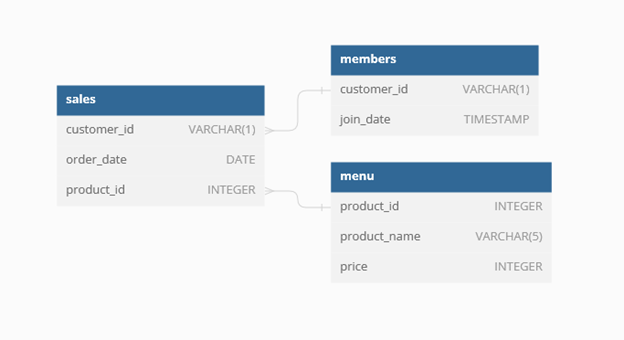

## Case Study Questions
---

**1. What is the total amount each customer spent at the restaurant?**
 ```
	   SELECT 
		   customer_id as Customer, 
		   CONCAT('$ ', SUM(price)) as Total_Spent
	   FROM dbo.sales sal
	   JOIN dbo.menu mnu
		   ON sal.product_id = mnu.product_id
	   GROUP BY customer_id
 ```
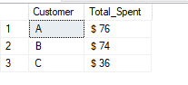
---
**2. How many days has each customer visited the restaurant?**
```
	SELECT 
		customer_id as Customer,
		COUNT(DISTINCT order_date) as num_of_visits
	FROM dbo.sales
	GROUP BY customer_id
```
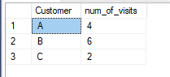
---
**3. What was the first item from the menu purchased by each customer?**
```
	SELECT 
		DISTINCT s.customer_id, 
		m.product_name
	FROM sales s
	JOIN menu m 
		ON s.product_id = m.product_id
	JOIN(
		SELECT customer_id, min(order_date) as first_order_date
		FROM sales
		GROUP BY customer_id
		) AS fo 
		ON s.customer_id = fo.customer_id 
		AND s.order_date = fo.first_order_date;
```
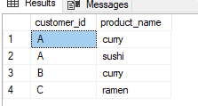
---
**4. What is the most purchased item on the menu and how many times was it purchased by all customers?**
```
	SELECT TOP 1 
		m.product_name, 
		COUNT(*) AS purchase_count
	FROM sales s
	JOIN menu m ON s.product_id = m.product_id
	GROUP BY m.product_name
	ORDER BY purchase_count DESC;
```
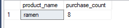
---
**5. Which item was the most popular for each customer?**
```
	SELECT 
		customer_id, 
		product_name, 
		purchase_count
	FROM (
		SELECT 
			s.customer_id, m.product_name, COUNT(*) AS purchase_count,
			RANK() OVER (PARTITION BY s.customer_id ORDER BY COUNT(*) DESC) as rnk
		FROM sales s
		JOIN  menu m
			ON s.product_id = m.product_id
		GROUP BY s.customer_id, m.product_name ) as subquery
	WHERE rnk = 1;

```
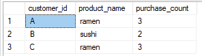
---
**6. Which item was purchased first by the customer after they became a member?**
```
	with cte as (
		SELECT 
			s.customer_id, 
			m.product_name, 
			order_date, 
			ROW_NUMBER() OVER (PARTITION BY s.customer_id ORDER BY order_date DESC) as rn
		FROM sales s
		JOIN menu m
			ON s.product_id = m.product_id
		JOIN members mem
			ON mem.customer_id = s.customer_id
		WHERE s.order_date > mem.join_date)

	SELECT customer_id, product_name, order_date
	FROM cte
	WHERE rn = 1;
```
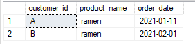
---
**7. Which item was purchased just before the customer became a member?**
```
	WITH BFR as (
		SELECT 
			s.customer_id, 
			m.product_name, 
			s.order_date,
			ROW_NUMBER() OVER (PARTITION BY s.customer_id ORDER BY order_date DESC) as rn
		FROM sales s
		JOIN menu m
			ON s.product_id = m.product_id
		JOIN members mem
			ON s.customer_id = mem.customer_id
		WHERE s.order_date < join_date) 

	SELECT customer_id, product_name, order_date
	FROM BFR
	WHERE rn = 1;
```
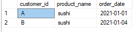
---
**8. What is the total items and amount spent for each member before they became a member?**
```
	SELECT 
		s.customer_id, 
		COUNT(*) as total_items, 
		SUM(m.price) as total_spent
	FROM sales s
	JOIN menu m
		ON s.product_id = m.product_id
	JOIN members mem
		ON s.customer_id = mem.customer_id
	WHERE order_date < join_date
	GROUP BY s.customer_id;
```
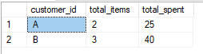
---
**9. If each $1 spent equates to 10 points and sushi has a 2x points multiplier -** 
**   how many points would each customer have?**
```
	SELECT 
		customer_id,
		SUM(CASE 
			WHEN product_name = 'sushi' THEN (price*20)
			ELSE (price*10)
		END) as total_points
	FROM sales s
	JOIN menu m
		ON s.product_id = m.product_id
	GROUP BY customer_id;
```
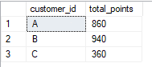
---
**10. In the first week after a customer joins the program (including their join date) **
**    they earn 2x points on all items, not just sushi. How many points do customer A and B have at the end of January?**
```
	SELECT 
		s.customer_id,
		SUM(CASE
			WHEN order_date BETWEEN join_date AND DATEADD(week,1,join_date) THEN m.price*20
			ELSE m.price*10
			END) AS total_points
	FROM sales s
	JOIN menu m
		ON s.product_id = m.product_id
	JOIN members mem
		ON s.customer_id = mem.customer_id
	WHERE DATEPART(MONTH,s.order_date) = 1
		AND DATEPART(DAY,s.order_date) <= 31 
	GROUP BY s.customer_id;
```
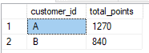
---

## Bonus Questions
## Join All The Tables
---
```
	SELECT 
		s.customer_id,
		s.order_date,
		m.product_name,
		m.price,
		CASE 
			WHEN order_date >= join_date THEN 'Y'
			ELSE 'N'
			END as member
	FROM sales s
	JOIN menu m
		ON s.product_id = m.product_id
	LEFT JOIN members mem
		ON s.customer_id = mem.customer_id;
```
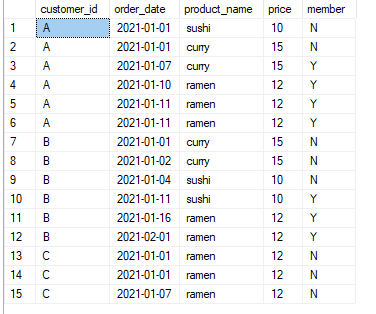
---
## Rank All The Things <br>
Danny also requires further information about the ranking of customer products, but he purposely does not need the ranking for non-member purchases so he expects null ranking values for the records when customers are not yet part of the loyalty program.
```
	WITH CTE1 AS (SELECT 
			s.customer_id,
			s.order_date,
			m.product_name,
			m.price,
			CASE 
				WHEN order_date >= join_date THEN 'Y'
				ELSE 'N'
				END as member
		FROM sales s
		JOIN menu m
			ON s.product_id = m.product_id
		LEFT JOIN members mem
			ON s.customer_id = mem.customer_id)

	SELECT 
		customer_id,
		order_date,
		product_name,
		price,
		member,
		CASE 
			WHEN member = 'Y' THEN ROW_NUMBER() OVER (PARTITION BY member ORDER BY order_date ASC)
			ELSE NULL
		END as Ranking
	FROM CTE1
	ORDER BY customer_id, order_date
```
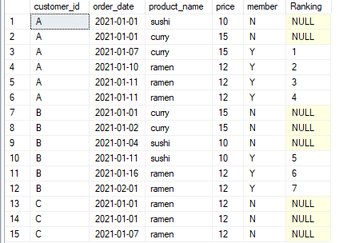

### Thank you for taking your time in going through my solution :)
